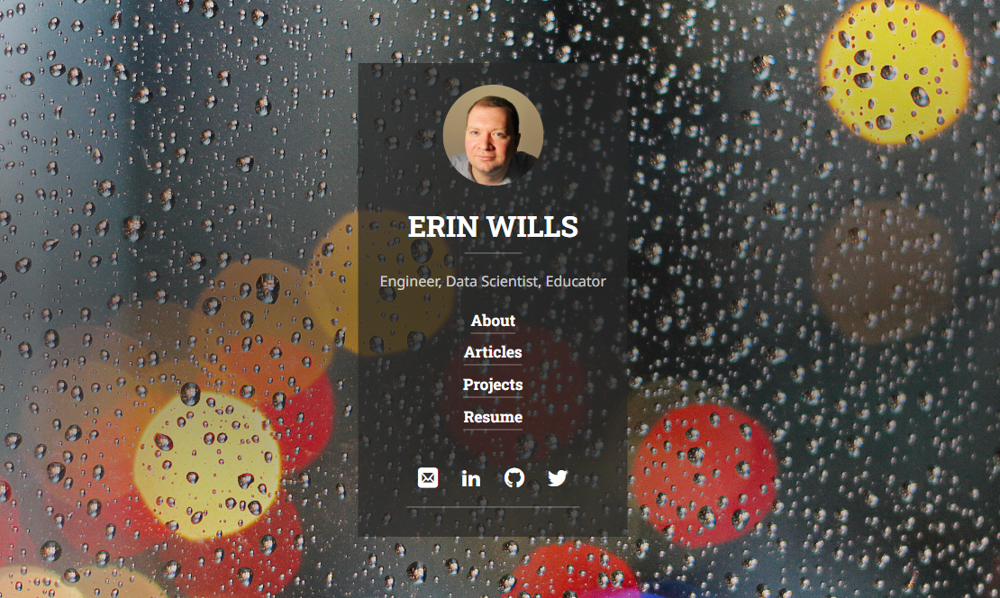
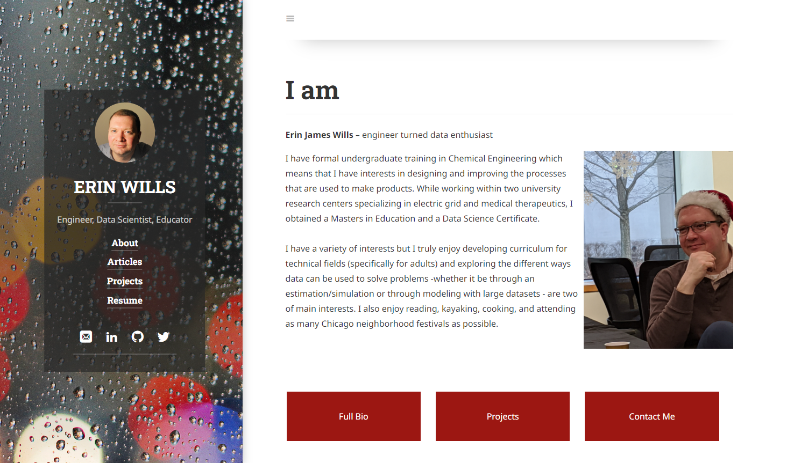
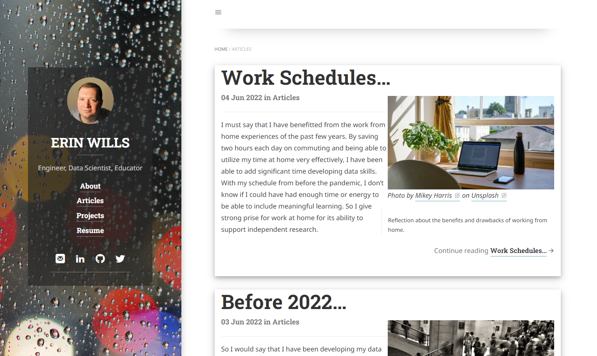

# ejw-data.github.io

Author:  Erin James Wills - ejw.data@gmail.com  

  
<cite>Photo by Erin Wills</cite>

## Overview

I am not a big fan of static websites.  I used Jekyll for this website since it removes some of my key irriations.  For example, templates can be used to add in modules and generate post pages.  The greatly reduces the amount of repetitive tasks.  Overall, I would say Jekyll is a nice templating system and I think I might like the use of `Liquid` templating language over similar systems like `Jinja`.  I'm not sure how I feel about the mix of markdown and HTML to generate the pages.  The original theme can be found at [hydejack.com](https://hydejack.com/).  

## Jekyll Hydejack Features:
* Beautiful Modal-like Home Page 
* Responsive Layout
* Supports Multiple Markdown Features
* Some Built-in Styling

## Github Pages  

https://ejw-data.github.io/
   

 

## Technologies   
*  Jekyll
*  Markdown 
*  HTML/CSS/JS

 

## Data Source  

Not applicable

 

## Setup and Installation  

1. Clone the repo to your local machine
1. Open repo folder in an IDE like VSCode
1. Using a virtual server like the VSCode extention LiveServer
1. Run `index.html`  

 

## Examples

  

 

  

 

 
